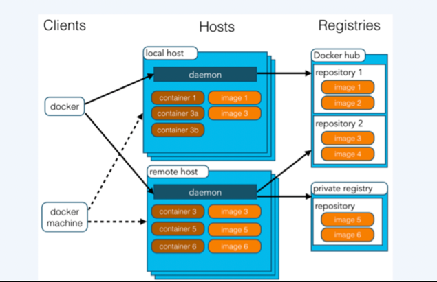
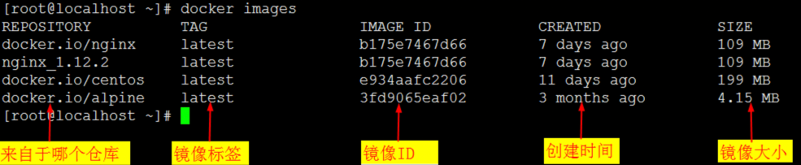

## 1、Docker 架构

Docker 使用客户端-服务器 (C/S) 架构模式，使用远程API来管理和创建Docker容器。
Docker 容器通过 Docker 镜像来创建。
容器与镜像的关系类似于面向对象编程中的对象与类。
Docker 面向对象
容器 对象
镜像 类

 

```
Docker 镜像(Images) Docker 镜像是用于创建 Docker 容器的模板。
Docker 容器(Container) 容器是独立运行的一个或一组应用。
Docker 客户端(Client) Docker 客户端通过命令行或者其他工具使用 Docker API (https://docs.docker.com/reference/api/docker_remote_api) 与 Docker 的守护进程通信。
Docker 主机(Host) 一个物理或者虚拟的机器用于执行 Docker 守护进程和容器。
Docker 仓库(Registry) Docker 仓库用来保存镜像，可以理解为代码控制中的代码仓库。Docker Hub(https://hub.docker.com) 提供了庞大的镜像集合供使用。
Docker Machine Docker Machine是一个简化Docker安装的命令行工具，通过一个简单的命令行即可在相应的平台上安装Docker，比如VirtualBox、 Digital Ocean、Microsoft Azure。
Docker项目的目标是实现轻量级的操作系统虚拟化解决方案。Docker的基础是linux容器（LXC）等技术。
```

## 2、Docker的概念，安装及镜像管理

### 2.1、docker的概念：

```
镜像：是一个只读的模板，类似于安装系统用到的那个iso文件，我们通过镜像来完成各种应用的部署。镜像可以用来创建Docker容器
容器：镜像类似于操作系统，而容器类似于虚拟机本身。它可以被启动、开始、停止、删除等操作，每个容器都是相互隔离的。可以把容器看做是一个简易版的linux环境（包括root用户权限、进程空间、用户空间和网络空间等）和运行在其中的应用程序。
仓库：存放镜像的一个场所，仓库分为公开仓库和私有仓库。 最大的公开仓库是Docker hub（hub.docker.com），国内公开仓库（dockerpool.com）
```

### 2.2、docker安装启动：

配置宿主机网卡转发

```powershell
## 配置网卡转发,看值是否为1
$ sysctl -a |grep -w net.ipv4.ip_forward
net.ipv4.ip_forward = 1

## 若未配置，需要执行如下
$ cat <<EOF >  /etc/sysctl.d/docker.conf
net.bridge.bridge-nf-call-ip6tables = 1
net.bridge.bridge-nf-call-iptables = 1
net.ipv4.ip_forward=1
EOF
$ sysctl -p /etc/sysctl.d/docker.conf
```

Yum安装配置docker

```powershell
## 下载阿里源repo文件
curl -o /etc/yum.repos.d/Centos-7.repo http://mirrors.aliyun.com/repo/Centos-7.repo
curl -o /etc/yum.repos.d/docker-ce.repo http://mirrors.aliyun.com/docker-ce/linux/centos/docker-ce.repo

## yum安装
yum install -y docker-ce
## 查看源中可用版本
yum list docker-ce --showduplicates | sort -r
## 安装指定版本
yum install -y docker-ce-18.09.9

## 配置源加速
mkdir -p /etc/docker
vi /etc/docker/daemon.json
{
  "registry-mirrors" : [
    "https://dockerhub.azk8s.cn",
    "https://reg-mirror.qiniu.com",
    "https://registry.docker-cn.com",
    "https://ot2k4d59.mirror.aliyuncs.com/"
  ]
}

## 设置开机自启
systemctl enable docker  
systemctl daemon-reload

## 启动docker
systemctl start docker 

## 查看docker信息
docker info
```

### 2.3、镜像管理

#### 2.3.1、获取镜像

```
语法：docker pull NAME[:TAG]
其中，NAME是镜像仓库的名称（用来区分镜像），TAG是镜像的标签（用来表示版本信息）

docker pull  nginx
```

#### 2.3.2、查看镜像

```
语法：docker images

[root@localhost ~]# docker images
REPOSITORY          TAG                 IMAGE ID            CREATED             SIZE
docker.io/nginx     latest              b175e7467d66        2 days ago          109 MB
```



```
docker tag centos long：为centos镜像设置标签为long，再使用docker images查看会多出来一行，打了标签的image id和centos的一样

[root@localhost ~]# docker tag nginx nginx_1.12.2
[root@localhost ~]# docker images
REPOSITORY          TAG                 IMAGE ID            CREATED             SIZE
docker.io/nginx     latest              b175e7467d66        2 days ago          109 MB
nginx_1.12.2        latest              b175e7467d66        2 days ago          109 MB
docker inspect {IMAGE_ID | IMAGE_NAME}：获取镜像详细信息

[root@localhost ~]# docker inspect nginx
返回的是一个JSON格式的消息，如果我们只要其中一项内容时，可以使用参数-f来指定，例如，获取镜像的Architecture
[root@localhost ~]# docker inspect -f {{".Architecture"}} nginx
amd64
```

#### 2.3.3、搜索镜像

```
docker search [image-name]：从docker仓库搜索docker镜像，后面是关键词

[root@localhost ~]# docker search nginx
```

#### 2.3.4、删除镜像

```
docker rmi centos：用来删除指定镜像， 其中后面的参数可以是tag，如果是tag时，实际上是删除该tag，只要该镜像还有其他tag，就不会删除该镜像。当后面的参数为镜像ID时，则会彻底删除整个镜像，连通所有标签一同删除

[root@localhost ~]# docker rmi nginx_1111
Untagged: nginx_1111:latest
Untagged: docker.io/nginx@sha256:37350fbb4afbb1c01b6e542fe1537dd701e4430983d6d9c673cbb5eccdbec357
docker rmi -f centos：强制删除，一般不建议使用，会导致某些问题

[root@localhost ~]# docker rmi -f nginx_1111 
Untagged: nginx_1111:latest
```

#### 2.3.5、创建镜像

创建镜像的方法有以下3种方式：
（1）基于已有镜像的容器创建
（2）基于本地模板导入
（3）基于Dockerfile创建

```
（1）基于已有镜像的容器创建
命令格式：docker commit [OPTIONS] CONTAINER [REPOSITORY[:TAG]]
主要选项：
-a：作者信息
-m：提交消息
-p：提交时暂停容器运行
运行docker run后，进入到该容器中，我们做一些变更，比如安装一些东西，然后针对这个容器进行创建新的镜像
[root@localhost ~]# docker ps -a   //查看所有的容器

[root@localhost ~]# docker start 67d   //启动ID为67d的容器,ID可简写为前3位
[root@localhost ~]# docker exec -it 67d /bin/bash    //进入67d容器
[root@67dde53e0651 /]# yum install -y net-tools wget
[root@67dde53e0651 /]# exit
[root@localhost ~]# docker commit -m "centos_with_nettools_wget" -a "long" 67d centos_with_net       //创建新的镜像
sha256:90f2a945a44d466c8a8d46dcdd4ab80f9f2aab79761482a1b5839d9ea2cf7904

tips：这个命令有点像svn的提交，-m 加一些改动信息，-a 指定作者相关信息  67d这一串为容器id，再后面为新镜像的名字   

[root@localhost ~]# docker images
REPOSITORY        TAG               IMAGE ID            CREATED          SIZE
centos_with_net   latest           90f2a945a44d     32 seconds ago    300.6MB
docker.io/centos  latest           328edcd84f1b     11 days ago       192.5MB
long              long             328edcd84f1b      11 days ago      192.5MB
（2）基于本地模板导入
模块获取，可以直接在网上下载一个模块 
[root@izwz920g719hydx1spem46z ~]# wget https://download.openvz.org/template/precreated/contrib/centos-7-x86_64-minimal-20170709.tar.xz

http://openvz.org/Download/templates/precreated 可惜速度并不快，若我们下载了一个centos的模板 centos-7-x86_64-minimal-20170709.tar.xz那么导入该镜像的命令为：
cat centos-7-x86_64-minimal-20170709.tar.xz |docker import - centos-5-x86
```

#### 2.3.6、存出和载入镜像以及上传镜像

```
docker save -o ***.tar IMAGE:TAG
docker load --input ***.tar 或 dokcer load < ***.tar
docker push IMAGE_NAME
把现有镜像，导出为一个文件，可以作为备份：
docker save -o long.tar long:long

我们还可以用该文件恢复本地镜像：
docker load --input long.tar  或者
docker load < long.tar

docker push image_name  //可以把自己的镜像传到dockerhub官方网站上去，但前提是需要先注册一个用户，后续如果有需求再研究吧
```

## 3、操作Docker容器

### 3.1、创建容器

当使用docker run来创建并启动容器时，Docker在后台运行的标准操作：
（1）检查本地是否存在指定的镜像centos，不存在就从公有仓库下载
（2）利用镜像创建并启动一个容器
（3）分配一个文件系统，并在只读的镜像层外面挂载一层可读写层
（4）从宿主主机配置的桥接网络接口中桥接一个虚拟接口到容器中去
（5）从地址池配置一个IP地址给容器
（6）执行用户指定的应用程序
（7）执行完毕后，容器被终止

```
语法：
创建容器：docker create -it {image_name}
docker create命令新建的容器处于停止状态，可以使用docker start命令来启动它。

启动容器：docker start {container_id}

新建并启动容器：docker run -t -i centos  /bin/bash
用下载到的镜像开启容器，-i表示让容器的标准输入打开，-t表示分配一个伪终端，要把-i -t 放到镜像名字前面
[root@localhost ~]# docker run -t -i nginx /bin/bash
root@c1eff06c8501:/# 

守护态运行容器：docker run -itd centos /bin/bash
```

### 3.2、终止容器

可以使用docker stop来终止一个运行中的容器，改命令的格式为`docker stoop [container]`
首先向容器发送SIGTERM信号，等待一段超时时间（默认为10s）后，再发送SIGKILL信号来终止容器
`docker kill`命令会直接发送SIGKILL信号来强行终止容器

```
[root@localhost ~]# docker ps
CONTAINER ID        IMAGE      COMMAND         CREATED        STATUS          PORTS      NAMES
402e1bd8ff16        centos   "/bin/bash"     16 hours ago    Up 16 hours                mynginx
[root@localhost ~]# docker stop mynginx
mynginx
```

### 3.3、进入容器

```

（1）exec命令（推荐方式）
[root@localhost ~]# docker exec -it mynginx /bin/bash
[root@402e1bd8ff16 /]# 
```

### 3.4、删除容器

可以使用docker rm 命令来删除处于终止或退出状态的容器，命令格式为`docker rm <container>`
默认情况下，docker rm 只能删除处于终止或退出状态的容器，并不能删除还处于运行状态的容器。如果需要直接删除一个运行中的容器，可以添加-f参数。Docker会先发送SIGKILL信号给容器，终止其中的应用，之后强行删除。
选项：
`-f：`强行终止并删除在运行的一个容器
`-l：`删除容器的链接，但保留容器
`-v：`删除容器挂载的数据卷

```
`[root@localhost ~]``# docker rm nginx2``nginx2`
```

### 3.5、导入和导出容器

```
导出容器是指导出一个已经创建的容器到一个文件，不管此时这个容器是否处于运行状态，可以使用docker export命令
格式为：docker export CONTAINER_ID
docker export container_id &gt; file.tar // 导出容器，可以迁移到其他机器上，需要导入
举例：

[root@localhost ~]# docker ps
CONTAINER ID        IMAGE               COMMAND             CREATED             STATUS              PORTS                NAMES
c40ae00fd190        centos_1            "bash"              14 hours ago        Up 14 hours         0.0.0.0:82->80/tcp   mad_yonath
84acb55af1f9        nginx               "bash"              14 hours ago        Up 14 hours         0.0.0.0:81->80/tcp   prickly_montalcini
[root@localhost ~]# docker export 84acb55af1f9 > file.tar
导出的文件file.tar又可以使用docker import 命令导入，成为镜像
格式：cat ***.tar |docker import - IMAGENAME:TAG

[root@localhost ~]# cat /tmp/mynginx.tar |docker import - test/nginx:v1
sha256:f133989eba3b11f0b81e6976421f9510a94d8692cceb7505c4d98029870cd110
[root@localhost ~]# docker images
REPOSITORY          TAG                 IMAGE ID            CREATED             SIZE
test/nginx          v1                  f133989eba3b        3 seconds ago       199 MB
```

### 3.6、docker的基础命令

```
[root@localhost ~]# docker -h
Flag shorthand -h has been deprecated, please use --help

Usage:  docker COMMAND

A self-sufficient runtime for containers

Options:
--config string     Location of client config files (default "/root/.docker") #客户端配置文件的位置

-D, --debug         Enable debug mode  #启用Debug调试模式

--help              Print usage  #查看帮助信息

-H, --host list     Daemon socket(s) to connect to (default [])  #守护进程的套接字（Socket）连接

-l, --log-level string   Set the logging level ("debug", "info", "warn", "error", "fatal") (default "info")    #设置日志级别

-v, --version            Print version information and quit  #打印版本信息并退出

Commands:
  attach      Attach to a running container  #进入一个正在运行的容器

  build       Build an image from a Dockerfile  #通过Dockerfile创建镜像

  commit      Create a new image from a container's changes   #提交当前容器为一个新的镜像

  cp          Copy files/folders between a container and the local filesystem #从容器中拷贝指定文件或者目录到宿主机中

  create      Create a new container  #创建一个新的容器

  diff        Inspect changes on a container's filesystem  #查看docker容器变化

  events      Get real time events from the server   #从docker服务获取容器实时事件

  exec        Run a command in a running container   #在一个已经运行的容器中运行一条命令

  export      Export a container's filesystem as a tar archive #导出容器的内容流作为一个tar归档文件

  history     Show the history of an image #展示一个镜像形成历史

  images      List images #列出系统当前镜像

  import      Import the contents from a tarball to create a filesystem image #导入一个镜像

  info        Display system-wide information  #显示系统信息

  inspect     Return low-level information on Docker objects  #查看容器详细信息

  kill        Kill one or more running containers  #kill指定docker容器

  load        Load an image from a tar archive or STDIN  #从一个tar包中加载一个镜像(对应save)

  login       Log in to a Docker registry  #注册或者登陆一个docker源服务器

  logout      Log out from a Docker registry  #从当前Docker registry退出

  logs        Fetch the logs of a container   #输出当前容器日志信息

  pause       Pause all processes within one or more containers  #暂停容器

  port        List port mappings or a specific mapping for the container   #查看映射端口对应的容器内部源端口

  ps          List containers  #列出容器列表

  pull        Pull an image or a repository from a registry #从docker镜像源服务器拉取指定镜像或者库镜像

  push        Push an image or a repository to a registry   #推送指定镜像或者库镜像至docker源服务器

  rename      Rename a container #重命名容器

  restart     Restart one or more containers   #重启运行的容器

  rm          Remove one or more containers  #移除一个或者多个容器

  rmi         Remove one or more images  #移除一个或者多个镜像

  run         Run a command in a new container  #创建一个新的容器并运行一个命令

  save        Save one or more images to a tar archive (streamed to STDOUT by default)  保存一个镜像为一个tar包(对应load)

  search      Search the Docker Hub for images  #在docker hub中搜索镜像

  start       Start one or more stopped containers   #启动容器

  stats       Display a live stream of container(s) resource usage statistics #统计容器使用资源

  stop        Stop one or more running containers   #停止容器

  tag         Create a tag TARGET_IMAGE that refers to SOURCE_IMAGE   #给源中镜像打标签

  top         Display the running processes of a container  #查看容器中运行的进程信息

  unpause     Unpause all processes within one or more containers  #取消暂停容器

  update      Update configuration of one or more containers  #更新一个或多个容器的配置信息

  version     Show the Docker version information  #查看容器版本号

  wait        Block until one or more containers stop, then print their exit codes #截取容器停止时的退出状态值

Run 'docker COMMAND --help' for more information on a command.  #运行docker命令在帮助可以获取更多信息
```

## 4、访问Docker仓库

### 4.1、解析Docker 仓库

> 仓库（Repository）是集中存放镜像的地方。
> 一个容易混淆的的概念是注册服务器（`Registry`）。实际上注册服务器是存放仓库的具体服务器，每个服务器上都有很多个仓库，而每个仓库下面都有多个镜像。从这方面来说，仓库可以认为是一个具体的项目或目录。例如对于仓库地址`dl.dockerpool.com/centos`来说，`dl.dockerpool.com`是注册服务器地址，`centos`是仓库名。
> 仓库又分为公有仓库（public）和私有仓库（private）

### 4.2、创建和使用私有仓库

> 使用registry镜像来创建私有仓库:`docker pull registry`
> //以registry镜像启动容器，-p会把容器的端口映射到宿主机上，:左边为宿主机监听端口，:右边为容器监听端口
>
> ```
> [root@localhost ~]# docker run -d -p 5000:5000 --restart always --name registry registry:2 #这里将自动下载registry镜像并启动容器，创建本地私有仓库。
> Unable to find image 'registry:2' locally
> Trying to pull repository docker.io/library/registry ... 
> latest: Pulling from docker.io/library/registry
> 49388a8c9c86: Pull complete 
> e4d43608dd22: Pull complete 
> 3a41740f900c: Pull complete 
> e16ef4b76684: Pull complete 
> 65f212f7c778: Pull complete 
> Digest: sha256:d837de65fd9bdb81d74055f1dc9cc9154ad5d8d5328f42f57f273000c402c76d
> c9bba59aa7ce072b888ca8214a76211bf03cf9d3bcb55d2183183b876683f33f
> 
> [root@localhost ~]# docker ps
> CONTAINER ID        IMAGE               COMMAND                  CREATED              STATUS              PORTS                    NAMES
> c9bba59aa7ce        registry:2            "/entrypoint.sh /etc/"   About a minute ago   Up About a minute   0.0.0.0:5000->5000/tcp   sick_wozniak
> ```
>
> 默认的情况下，会将仓库创建在容器的/var/lib/registry 目录下，可以通过-v参数来将镜像文件存放在本地的指定路径上。
>
> ```
> [root@localhost ~]# mkdir -p /opt/data/registry
> [root@localhost ~]# docker run -d -p 5000:5000  --restart always -v /opt/data/registry:/var/lib/registry  registry:2
> [root@localhost ~]# docker images
> REPOSITORY                   TAG                 IMAGE ID            CREATED             SIZE
> test/nginx                 1.10.1              def358072817        3 hours ago         106.7 MB
> [root@localhost ~]# docker tag test/nginx:1.10.1 192.168.0.134:5000/test2 //标记一下tag，必须带有私有仓库的ip:port
> [root@localhost ~]# docker push 192.168.0.134:5000/test2
> Get https://192.168.0.165:5000/v2/: http: server gave HTTP response to HTTPS client
> tips：由于客户端采用https，docker registry未采用https服务所致。<br/>处理方法：更改配置文件：/etc/docker/daemon.json
> 
> [root@localhost ~]# vim /etc/docker/daemon.json
> {"insecure-registries":["192.168.0.134:5000"]}
> 修改完配置文件需要进行重启docker
> [root@localhost ~]# systemctl restart docker
> 
> 
> [root@localhost ~]# docker push 192.168.0.134:5000/test2
> The push refers to a repository [192.168.0.134:5000/test2]
> c4c704007df5: Pushed 
> latest: digest: sha256:2fa255d11989458a1f9d3173e36a911c5f40c0ba1d74b16608a27ba52fa9237a size: 528
> [root@localhost ~]# curl http://192.168.0.134:5000/v2/_catalog
> {"repositories":["test2"]}
> 
> 在第二台机器（192.168.0.136）上进行验证私有仓库是否可用
> [root@backup ~]# yum install -y docker
> [root@backup ~]# systemctl start docker
> [root@backup ~]# curl http://192.168.0.134:5000/v2/_catalog
> {"repositories":["test2"]}
> [root@backup ~]# docker pull 192.168.0.134:5000/test2
> Using default tag: latest
> Trying to pull repository 192.168.0.134:5000/test2 ... 
> Get https://192.168.0.165:5000/v1/_ping: http: server gave HTTP response to HTTPS client
> 出现在docker私有仓库一样的错误，于是同样修改配置文件
> [root@backup ~]# vim /etc/docker/daemon.json
> {"insecure-registries":["192.168.0.134:5000"]}
> [root@backup ~]# systemctl restart docker
> [root@backup ~]# docker pull 192.168.0.134:5000/test2
> Using default tag: latest
> Trying to pull repository 192.168.0.134:5000/test2 ... 
> latest: Pulling from 192.168.0.134:5000/test2
> 9ff86f02c57e: Pull complete 
> Digest: sha256:2fa255d11989458a1f9d3173e36a911c5f40c0ba1d74b16608a27ba52fa9237a
> [root@backup ~]# docker images
> REPOSITORY                 TAG                 IMAGE ID            CREATED                  SIZE
> 192.168.0.165:5000/test2   latest              def358072817        Less than a second ago   106.7 MB
> 小结：
> 仓库概念的引入，为Docker镜像文件的分发和管理提供了便捷的途径，在企业生产环境中，则往往需要使用私有仓库来维护内部镜像。
> ```
> 
>## 5、Docker数据管理
> 
>用户在使用Docker的过程中，往往需要能查看容器内应用产生的数据，或者需要把容器内的数据进行备份，甚至多个容器之间进行数据共享，这必然涉及到容器的数据管理操作。
> 容器中管理数据主要有两种方式：
> （1）数据卷（`Data Volumes`）
> （2）数据卷容器（`Data Volumes Dontainers`）
> 
>### 5.1、数据卷
> 
>数据卷可以是一个可供容器使用的特殊目录。
> `a.`数据卷可以在容器中共享和重用
> `b.`对数据卷修改会立马生效
> `c.`对数据卷更新，不会影响镜像
> `d.`卷会一直存在，直到没有容器使用
> 数据卷的使用，类似于Linux下对目录或文件进行mount操作
> 在容器内创建一个数据卷
> 在使用`docker run`命令的时候，使用`-v`标记可以在容器内创建一个数据卷，多次使用`-v`标记，可以创建多个数据卷。使用-v标记也可以指定本地的已有的目录到容器中作为数据卷。也就是映射宿主机目录到容器中去。这个功能在测试的时候十分方便，比如用户可以放置一些程序或数据到本地目录，然后再容器中运行和使用。另外，本地目录的路径必须是绝对路径，如果目录不存在，Docker会自行创建。
> Docker挂载数据卷的默认权限是`rw`，用户也可以通过指定权限，`ro`指定可读：
> `docker run -itd -P --name web2 -v /data:/data:ro centos_nginx:1.10 bash`
> 同时，也可以挂载本地主机的一个文件作为数据卷
> `docker run -it --rm -P --name web2 -v ~/.bash_history:/.bash_history centos_nginx:1.10 bash`
> 
>### 5.2、挂载本地的目录到容器里
> 
>```
> （1）查看本地镜像
> [root@localhost ~]# docker images   
> REPOSITORY                      TAG                 IMAGE ID            CREATED             SIZE
> centos_nginx                    1.10                3cdab9e3fdbb        19 hours ago        361.6 MB
> centos_nginx                    latest              3cdab9e3fdbb        19 hours ago        361.6 MB
> 
> （2）创建容器，并将本地/data目录映射到容器中
> [root@localhost ~]# docker run -itd -P --name web2 -v /data:/data centos_nginx:1.10 bash    
> 52babe20009cb2366ebe0a9e3633140bcaa2d92e2057c56e47b8377960f43d62
> //-v 用来指定挂载目录，:前面的/data/为宿主机本地目录，:后面的/data/为容器里的目录，会在容器中自动创建
> [root@localhost ~]# docker ps
> CONTAINER ID        IMAGE               COMMAND                  CREATED             STATUS              PORTS                    NAMES
> 52babe20009c        centos_nginx:1.10   "bash"                   3 seconds ago       Up 3 seconds        0.0.0.0:32771->80/tcp    web2
> 
> （3）在数据卷目录中创建目录123
> [root@localhost ~]# docker exec -it 52babe20009c bash
> [root@52babe20009c /]# mkdir /data/123  
> [root@52babe20009c /]# ll /data/
> total 24
> drwxr-xr-x 2 root root 4096 Nov 12 07:06 123
> drwxr-xr-x 5 1003 1003 4096 Sep 30 03:17 logs
> drwxr-xr-x 8 1003 1003 4096 Oct 19 04:16 mysql
> drwxr-xr-x 3 1003 1003 4096 Sep 30 03:18 nginx
> drwxr-xr-x 2 1003 1003 4096 Oct  1 13:01 oldboy
> drwxr-xr-x 2 1003 1003 4096 Sep 30 03:17 web
> 
> （4）宿主机查看目录变化
> [root@localhost ~]# ll /data/   
> total 24
> drwxr-xr-x 2 root  root  4096 Nov 12 02:06 123
> drwxr-xr-x 5 mysql mysql 4096 Sep 29 23:17 logs
> drwxr-xr-x 8 mysql mysql 4096 Oct 19 00:16 mysql
> drwxr-xr-x 3 mysql mysql 4096 Sep 29 23:18 nginx
> drwxr-xr-x 2 mysql mysql 4096 Oct  1 09:01 oldboy
> drwxr-xr-x 2 mysql mysql 4096 Sep 29 23:17 web
> ```
> 
>### 5.3、数据卷容器
> 
>如果用户需要在容器之间共享一些持续更新的数据，最简单的方式是试用数据卷容器。数据卷容器其实就是一个普通的容器，专门用它来提供数据卷供其他容器挂载使用。
> 
>（1）首先创建一个数据卷容器`dbdata`，并在其中创建一个数据卷挂载到`/dbdata`
> 
>```
> [root@localhost ~]# docker run -it -v /dbdata --name dbdata centostips:这里的/dbdata是容器里的/dbdata目录，并非宿主机本地的目录
> ```
> 
>（2）查看`/dbdata`目录，并创建文件
> 
>```
> [root@8ee4460dccae /]# ls
> anaconda-post.log  bin  dbdata  dev  etc  home  lib  lib64  lost+found  media  mnt  opt  proc  root  run  sbin  srv  sys  tmp  usr  var
> [root@8ee4460dccae /]# touch /dbdata/long.txt
> [root@8ee4460dccae /]# ll /dbdata/
> total 0
> -rw-r--r-- 1 root root 0 Nov 12 07:12 long.txt
> [root@8ee4460dccae /]# exit
> ```
> 
>（3）通过`--volumes-from`来挂载`dbdata`容器中的数据卷，例如创建一个`db1`容器，并从`dbdata`容器挂载数据卷
> 
>```
> [root@localhost ~]# docker ps -a
> CONTAINER ID        IMAGE               COMMAND                  CREATED             STATUS              PORTS                    NAMES
> 8ee4460dccae        centos              "/bin/bash"              2 minutes ago       Exited (0) About a minute ago                 dbdata
> [root@localhost ~]# docker run -it --volumes-from dbdata --name db1 centos bash
> ```
> 
>（4）查看db1容器是否存在`/dbdata`目录，并在该目录下创建`long2.txt`文件
> 
>```
> [root@ee0f12d8023b /]# ll /dbdata/
> total 0
> -rw-r--r-- 1 root root 0 Nov 12 07:12 long.txt
> [root@ee0f12d8023b /]# touch /dbdata/long2.txt
> [root@ee0f12d8023b /]# exit
> ```
> 
>（5）进入`dbdata`容器查看是否有`long2.txt`
> 
>```
> [root@localhost ~]# docker exec -it 8ee4460dccae bash
> [root@8ee4460dccae /]# ll /dbdata/
> total 0
> -rw-r--r-- 1 root root 0 Nov 12 07:12 long.txt
> -rw-r--r-- 1 root root 0 Nov 12 07:15 long2.txt
> ```
> 
>（6）多次使用`--volumes-from`参数来从多个容器挂载多个数据卷
> 
>```
> [root@localhost ~]# docker run -itd --name db5 --volumes-from db1 --volumes-from db4 centos bash
> 9513d4c30a85601b8d0939e4b58e24697df6417fb0b82a5eb5dfc42ed729cc7b
> [root@localhost ~]# docker ps
> CONTAINER ID        IMAGE               COMMAND                  CREATED             STATUS              PORTS                    NAMES
> 9513d4c30a85        centos              "bash"                   5 seconds ago       Up 3 seconds                                 db5
> 72ae1898a04d        centos              "bash"                   56 seconds ago      Up 55 seconds                                db4
> ee0f12d8023b        centos              "/bin/bash"              51 minutes ago      Up 50 minutes                                db1
> [root@localhost ~]# docker exec -it db5 bash
> [root@9513d4c30a85 /]# ls
> anaconda-post.log  bin  dbdata  dbdata4  dev  etc  home  lib  lib64  lost+found  media  mnt  opt  proc  root  run  sbin  srv  sys  tmp  usr  var
> ```
> 
>（7）还可以从其他已经挂载了容器卷的容器来挂载容器卷：
> 
>```
> [root@localhost ~]# docker ps
> CONTAINER ID        IMAGE               COMMAND                  CREATED             STATUS              PORTS                    NAMES
> ee0f12d8023b        centos              "/bin/bash"              47 minutes ago      Up 46 minutes                                db1
> 8ee4460dccae        centos              "/bin/bash"              49 minutes ago      Up 45 minutes                                dbdata
> [root@localhost ~]# docker run -it --name db2 --volumes-from db1 centos bash
> [root@701a34da1cde /]# ll /dbdata/
> total 0
> -rw-r--r-- 1 root root 0 Nov 12 07:12 long.txt
> -rw-r--r-- 1 root root 0 Nov 12 07:15 long2.txttips:使用--volumes-from参数所挂载数据卷的容器自身并不需要保持在运行状态，如果删除了挂载的容器（包括dbdata，db1，db2），数据卷并不会被自动删除，如果要删除一个数据卷，必须在删除最后一个还挂载着它的容器时显示使用docker rm -v 命令来指定删除关联的容器
> ```
> 
>（1）停止`db4`容器并删除
> 
>```
> [root@localhost ~]# docker stop db4
> db4
> [root@localhost ~]# docker rm db4
> db4
> ```
> 
>（2）进入`db5`容器查看数据卷`dbdata4`是否存在
> 
>```
> [root@localhost ~]# docker exec -it db5 bash
> [root@9513d4c30a85 /]# ls
> anaconda-post.log  bin  dbdata  dbdata4  dev  etc  home  lib  lib64  lost+found  media  mnt  opt  proc  root  run  sbin  srv  sys  tmp  usr  var
> ```
> 
>### 5.4、利用数据卷容器迁移数据
> 
>```
> 可以利用数据卷容器对其中的数据卷进行备份，恢复，以实现数据的迁移。
> （1）备份
> 
> [root@localhost ~]# docker run --volumes-from dbdata -v /backup:/backup --name work centos tar cvf /backup/backup.tar /dbdata
> tar: Removing leading `/' from member names
> /dbdata/
> /dbdata/long.txt
> /dbdata/long2.txt
> [root@localhost ~]# ll /backup/
> -rw-r--r-- 1 root root 10240 Nov 12 03:30 backup.tar
> 说明：首先利用centos镜像创建了一个容器work，使用--volumes-from dbdata参数来让容器挂载dbdata容器的数据卷（即dbdata数据卷）；-v /backup:/backup参数来将本地的备份目录（/backup）挂载到work容器的/backup目录。work容器启动后，使用了tar cvf /backup/backup.tar /dbdata命令来将/dbdata下的内容备份为容器内的/backup/backup.tar，即宿主机/backup目录下的/backup/backup.tar
> 
> （2）恢复
> 
> [root@localhost ~]# docker run -itd -v /dbdata --name db6 centos bash
> bb0357aba6fcee546eda5903f40cf61b3fd46a4ad9e0962e55550caaea10e06c
> [root@localhost ~]# docker run --volumes-from db6 -v /backup:/backup --name db7 centos tar xvf /backup/backup.tar 
> dbdata/
> dbdata/long.txt
> dbdata/long2.txt
> [root@localhost ~]# docker exec -it db6 bash
> [root@bb0357aba6fc /]# ll /dbdata/
> total 0
> -rw-r--r-- 1 root root 0 Nov 12 07:12 long.txt
> -rw-r--r-- 1 root root 0 Nov 12 07:15 long2.txt
> 说明：首先利用centos镜像新建一个db6的容器，然后通过--volumes-from参数挂载db6容器的数据卷（/dbdata）新建容器，并将本地的/backup目录映射到db7容器中。而后对/backup/backup.tar进行解压到/dbdata目录下，从而实现db6恢复/dbdata数据
> 
> 小结：
> 在生产环境中，在使用数据卷或者数据卷容器之外，定期将宿主机的本地数据进行备份，或者使用支持容错的存储系统，包括RAID或分布式文件系统。
> ```
> 
>## 6、端口映射和容器互联
> 
>### 6.1、端口映射，实现外部访问
> 
>> 在启动容器的时候，如果不指定对应的参数，在容器外部是无法通过网络进行访问容器内的应用和服务的。当容器中运行一些网络应用，要让外部访问这些应用，可以通过`-P`或`-p`参数来指定端口映射。当使用-P标记时，Docker会随机映射一个`49000~49900`的端口至容器内部开放的网络端口。
> > 端口映射的方式：
> 
>> ```
> > （1）映射所有接口地址
> > 使用hostPort:containerPort格式，将本地的5000端口映射到容器的5000端口，可以执行以下命令：
> > docker run -d -p 5000:5000 centos_nginx bash
> > 此时默认会绑定本地所有接口上的所有地址。多次使用-p标记可以绑定多个端口。例如：
> > docker run -d -p 5000:5000 -p 8082:80 centos_nginx bash
> > 
> > （2）映射到指定地址的指定端口
> > 可以使用ip:hostPort:containerPort格式指定映射一个特定的地址，例如localhost的地址127.0.0.1
> > docker run -d -p 127.0.0.1:5000:5000 centos_nginx bash
> > 
> > （3）映射到指定地址的任意端口
> > 使用ip::containerPort绑定localhost的任意端口到容器的5000端口，本地主机会任意分配一个端口
> > docker run -d -p 127.0.1.1::5000 centos_nginx bash
> > 
> > （4）查看端口映射情况
> > docker port container_name/container_id
> > ```
> >
> > 演示：
> >
> > ```
> > （1）以centos_nginx镜像启动一个容器（web_nginx）,并将宿主机8081端口进行映射
> > 
> > [root@localhost ~]# docker run -itd --name web_nginx -p 8081:80 centos_nginx bash
> > c558c2a986929f280e7b1db2c46c5951fa95670dfa54de1df83f8b0335241c3c
> > [root@localhost ~]# docker ps
> > CONTAINER ID        IMAGE               COMMAND             CREATED             STATUS              PORTS                  NAMES
> > c558c2a98692        centos_nginx        "bash"              6 seconds ago       Up 4 seconds        0.0.0.0:8081->80/tcp   web_nginx
> > （2）进入容器，启动nginx，发现Operation not permitted报错
> > 
> > [root@localhost ~]# docker exec -it web_nginx bash
> > [root@c558c2a98692 /]# ps -ef |grep nginx
> > root        26    13  0 05:59 ?        00:00:00 grep --color=auto nginx
> > [root@c558c2a98692 /]# systemctl start nginx
> > Failed to get D-Bus connection: Operation not permitted
> > 解决：
> > •新建的容器，启动nginx或者httpd服务的时候会报错
> > •Failed to get D-Bus connection: Operation not permitted
> > • 这是因为dbus-daemon没有启动，解决该问题可以这样做
> > • 启动容器时，要加上--privileged -e "container=docker"，并且最后面的命令改为/usr/sbin/init
> > docker run -itd --privileged -e "container=docker" centos_with_nginx /usr/sbin/init
> > 但是如果直接使用nginx命令直接启动，nginx也是可以的。
> > 
> > （3）删除容器，使用参数--privileged -e "container=docker",bash改为/usr/sbin/init重新启动一个容器，并查看端口映射
> > 
> > [root@localhost ~]# docker rm -f web_nginx
> > web_nginx
> > [root@localhost ~]# docker run -itd --privileged -e "container=docker" --name web_nginx -p 8081:80 centos_nginx /usr/sbin/init 
> > c57f0ef025b8b61ced5b39d6cf088f6258b536eecbe05868cb8adadf3610db44
> > [root@localhost ~]# docker ps 
> > CONTAINER ID        IMAGE               COMMAND             CREATED             STATUS              PORTS                  NAMES
> > c57f0ef025b8        centos_nginx        "/usr/sbin/init"    7 seconds ago       Up 6 seconds        0.0.0.0:8081->80/tcp   web_nginx
> > （4）启动nginx，并写入网页内容，查看是否实现端口映射
> > 
> > [root@localhost ~]# docker exec -it web_nginx bash
> > [root@c57f0ef025b8 /]# ps -ef |grep nginx
> > root        75    63  0 06:03 ?        00:00:00 grep --color=auto nginx
> > [root@c57f0ef025b8 /]# systemctl start nginx
> > [root@c57f0ef025b8 /]# ps -ef |grep nginx
> > root        82     1  0 06:03 ?        00:00:00 nginx: master process /usr/sbin/nginx
> > nginx       83    82  0 06:03 ?        00:00:00 nginx: worker process
> > root        85    63  0 06:03 ?        00:00:00 grep --color=auto nginx
> > [root@c57f0ef025b8 /]# cp /usr/share/nginx/html/index.html{,.bak}
> > [root@c57f0ef025b8 /]# echo "<h1> www.deng.com </h1>" > /usr/share/nginx/html/index.html
> > ```

　　

## 7、使用Dokcerfile创建镜像

### 7.1、Dockerfile基本结构

`Dockerfile`是为了快速构建镜像
`Dockerfile`由一行行命令语句组成，并且支持以#开头的注释行。
一般而言，`Dockerfile`分为4个部分：
`基础镜像信息
维护者信息
镜像操作指令
容器启动时执行指令`
示例：

```
#This dockerfile uses the centos image
#VERSION 1
#Author:docker_user
#Command format:Instruction [arguments / command] ..

#第一行必须制定基于的基础镜像
FROM centos
#维护者信息
MAINTAINER docker_user docker_user@email.com
#镜像的操作指令
RUN echo "hello world"
RUN yum update && yum install -y net-tools
RUN yum install -y nginx
#容器启动时执行指令
CMD /usr/sbin/nginx
```

其中，一开始必须指明所基于的镜像名称，接下来一般会说明维护者信息。
后面则是镜像操作指令，例如`RUN`指令，`RUN`指令将对镜像执行跟随的命令。每运行一条`RUN`指令，镜像添加新的一层，并提交。最后是`CMD`指令，来指定运行容器时操作的命令。

### 7.2、Dockerfile指令

指令的一般格式为`INSTRUCTION arguments`

```
（1）FROM
指定所创建镜像的基础镜像，如果本地不存在，则默认会去Docker Hub下载指定镜像。
格式：FROM &lt;image&gt;或 FROM &lt;image&gt;:&lt;tag&gt;
任何Dockerfile中的第一条指令必须为FROM指令。并且在同一个Dockerfile中创建多个镜像时，可以使用多个FROM指令（每个镜像一次）

（2）MAINTAINER
格式：MAINTAINER &lt;name&gt;，指定维护者信息
该信息会写入生成镜像的Author属性域中

（3）RUN
运行指定命令。
格式：RUN &lt;command&gt;或RUN ["executable","param1","param2"]。注意，后一个指令会被解析为Json数组，因此必须用双引号。
前者默认将在shell终端运行命令，即/bin/sh -c;后者则使用exec执行，不会启动shell环境。
比如：RUN yum install httpd
RUN ["/bin/bash","-c","echo hello"]
每条RUN指令将在当前镜像基础上执行指定命令，并提交为新镜像。当命令过长时，可以使用\来换行。

（4）CMD
CMD指令用来指定启动容器时默认执行的命令。
支持3种格式：
•CMD ["executable", "param1", "param2"]<br/>•CMD command param1 param2<br/>•CMD ["param1", "param2"]
RUN和CMD看起来很像，但是CMD用来指定容器启动时用到的命令，只能有一条。如果指定了多条命令，只有最后一条会被执行。如果用户启动容器时，指定了运行命令，则会覆盖掉CMD指定的命令。
比如：CMD ["/bin/bash", "/usr/local/nginx/sbin/nginx", "-c", "/usr/local/nginx/conf/nginx.conf"]

（5）EXPOSE
声明镜像内服务所监听的端口
格式：EXPOSE &lt;port&gt; [&lt;port&gt;...]
比如：EXPOSE 22 80 443
告诉Docker服务端容器暴露的端口号，供互联系统使用。在启动容器时需要通过-P，Docker主机会自动分配一个端口转发到指定端口；使用-p，则可以具体指定哪个本地端口映射过来。

（6）ENV
格式：ENV &lt;key&gt; &lt;value&gt;或ENV &lt;key&gt;=&lt;value&gt;，指定一个环境变量，会被后续RUN指令使用，在镜像启动的容器中也会存在。
比如：ENV PATH /usr/local/mysql/bin:$PATH

（7）ADD
格式：ADD &lt;src&gt; &lt;dest&gt;
将本地的一个文件或目录拷贝到容器的某个目录里。其中&lt;src&gt;为Dockerfile所在目录的相对路径，它也可以是一个URL；如果为tar文件，会自动解压到&lt;dest&gt;路径下。&lt;dest&gt;可以是镜像内的绝对路径，或者相对于工作目录（WORKDIR）的相对路径。
• ADD &lt;conf/vhosts&gt; &lt;/usr/local/nginx/conf&gt;

（8）COPY
格式：COPY &lt;src&gt; &lt;dest&gt;
复制本地主机的&lt;src&gt;(为Dockerfile所在目录的相对路径，文件或目录)为容器中的&lt;dest&gt;。目录路径不存在时，会自动创建。当使用本地目录为源目录时，推荐使用COPY。

（9）ENTRYPOINT
指定镜像的默认入口命令，该入口命令在启动容器时作为根命令执行，所有传入值作为该命令的参数
两种格式：
ENTRYPOINT ["executable", "param1", "param2"] （exec调用执行）<br/>ENTRYPOINT command param1 param2 （shell中执行）
此时，CMD指令指定值将作为根命令的参数
配置容器启动后执行的命令，并且不可被docker run 提供的参数覆盖，每个Dockerfile中只能有一个ENTRYPOINT,当指定多个ENTRYPOINT时，只有最后一个生效。
在运行时，可以被--entrypoint参数覆盖掉，如docker run --entrypoint
•我们在Dockerfile中指定如下CMD：
• CMD ["/bin/echo", "test"]
• 启动容器的命令是 docker run aming这样会输出test
• 假如启动容器的命令是 docker run -it aming /bin/bash 什么都不会输出
• ENTRYPOINT不会被覆盖，而且会比CMD或者docker run指定的命令要靠前执行
• ENTRYPOINT ["echo", "test"]
• docker run -it aming 123
• 则会输出 test 123，这相当于要执行命令 echo test 123

（10）VOLUME
创建一个数据卷挂载点
格式：VOLUME ["/data"]
创建一个可以从本地主机或其他容器挂载的挂载点，一般用于存放数据库和需要保持的数据等。

（11）USER
格式：USER daemon
指定运行容器时的用户名或UID，后续的RUN也会指定用户。
当服务不需要管理员权限时，可以通过该指令指定运行的用户。并且可以在之前创建所需要的用户。例如：
RUN groupadd -r postgres && useradd -r -g postgres postgres。要临时获取管理员权限可以使用gosu，而不推荐sudo

（12）WORKDIR
格式：WORKDIR /path/to/workdir
为后续的RUN，CMD，ENTRYPOINT指令配置工作目录。可以使用多个WORKDIR指令，后续命令如果参数是相对路径，则会基于之前命令指定的路径。例如：
WORKDIR /a<br/>WORKDIR b<br/>WORKDIR c<br/>RUN pwd
则最终路径为：/a/b/c

（13）ARG
指定一些镜像内使用的参数（例如版本号信息等），这些参数在执行docker build命令时，才以--build-arg&lt;varname&gt;=&lt;value&gt;格式传入
格式：ARG&lt;name&gt;[=&lt;default value&gt;]
则可以用docker build --build-arg&lt;name&gt;=&lt;value&gt;.来指定参数值

（14）ONBUILD
配置当所创建的镜像作为其他镜像的基础镜像时，所执行的创建操作指令。
格式：ONBUILD [INSTRUCTION]
例如，Dockerfile使用如下的内容创建了镜像image-A:
[...]<br/>ONBUILD ADD . /app/src<br/>ONBUILD RUN /usr/local/bin/python-build --dir /app/src<br/>[...]

如果基于image-A创建新的镜像时，新的Dockerfile中使用FROM image-A指定基础镜像，会自动执行ONBUILD指令的内容

（15）STOPSIGNAL
指定所创建镜像启动的容器接收退出的信号值。例如：
STOPSIGNAL signal

（16）HEALTHCHECK
配置所启动容器如何进行健康检查（如何判断健康与否），自docker 1.12开始支持
格式有两种：
HEALTHCHECK [OPTIONS] CMD command：根据所执行命令返回值是否为0来判断；
HEALTHCHECK NONE：禁止基础镜像中的健康检查。
OPTION支持：
①--interval=DURATION（默认为：30s）：过多久检查一次；
②--timeout=DURATION（默认为：30s）：每次检查等待结果的超时；
③--retries=N（默认为：3）：如果失败了，重试几次才最终确定失败。

（17）SHELL
指定其他命令使用shell时的默认shell类型
SHELL ["executable","parameters"]
默认值为["/bin/sh","-c"]
```

### 7.3、创建镜像

```
编写完Dockerfile之后，可以通过docker build命令来创建镜像。
格式：docker build [选项] 内容路径
该命令将读取指定路径下（包括子目录）的Dockerfile，并将该路径下的所有内容发送给Docker服务端，有服务端来创建镜像。因此除非生成镜像需要，否则一般建议放置Dockerfile的目录为空目录，可以使用-f选项来指定其路径。
①如果使用非内容路径下的Dockerfile，可以通过-f选项来指定其路径
②要指定生成镜像的标签信息，可以使用-t选项
例如：指定的Dockerfile所在路径为/tmp/docker_builder/，并且希望生成的镜像标签为build_repo/frist_image，可以使用：
docker build -t build_repo/first_image /tmp/docker_builder/
```

### 7.4、Dockerfile创建镜像示例（nginx）

#### （1）编辑Dockerfile文件

```
[root@localhost ~]# vim Dockerfile
FROM centos
MAINTAINER long 442305405@qq.com
RUN yum install -y pcre-devel wget net-tools gcc zlib zlib-devel make openssl-devel
ADD http://nginx.org/download/nginx-1.12.2.tar.gz .
RUN tar zxvf nginx-1.12.2.tar.gz
RUN mkdir -p /usr/local/nginx
RUN cd nginx-1.12.2 && ./configure --prefix=/usr/local/nginx && make && make install
RUN rm -fv /usr/local/nginx/conf/nginx.conf
ADD http://www.apelearn.com/study_v2/.nginx_conf /usr/local/nginx/conf/nginx.conf
ADD index.html /usr/local/nginx/html/index.html
RUN echo "daemon off;" >> /usr/local/nginx/conf/nginx.conf
EXPOSE 80
ENTRYPOINT /usr/local/nginx/sbin/nginx
```

#### （2）创建镜像

```
[root@localhost ~]# docker build -t centos_nginx:1.12.2 .
Sending build context to Docker daemon 212.7 MB
Step 1 : FROM centos
 ---> d123f4e55e12
Step 2 : MAINTAINER long 442305405@qq.com
 ---> Using cache
 ---> 42a2766d5cce
Step 3 : RUN yum install -y pcre-devel wget net-tools gcc zlib zlib-devel make openssl-devel
 ---> Running in ebd2bc43b045
Loaded plugins: fastestmirror, ovl
......
 Step 8 : RUN rm -fv /usr/local/nginx/conf/nginx.conf
 ---> Running in eb41c1c7b39d
removed '/usr/local/nginx/conf/nginx.conf'
 ---> d6b0d765ca2e
Removing intermediate container eb41c1c7b39d
Step 9 : ADD http://www.apelearn.com/study_v2/.nginx_conf /usr/local/nginx/conf/nginx.conf
Downloading [==================================================>] 1.678 kB/1.678 kB
 ---> efffda0c218d
Removing intermediate container af06898e74f4
Step 10 : EXPOSE 80
 ---> Running in fb3905caf714
 ---> 6efacb9d8a12
Removing intermediate container fb3905caf714
Step 11 : ENTRYPOINT /usr/local/nginx/sbin/nginx && tail -f /etc/passwd
 ---> Running in 61b617e30d2b
 ---> 02447e813325
Removing intermediate container 61b617e30d2b
Successfully built 02447e813325
```

#### （3）查看创建的镜像，并通过创建的镜像创建容器

```
[root@localhost ~]# docker images
REPOSITORY                      TAG                 IMAGE ID            CREATED              SIZE
centos_nginx                    1.12.2              02447e813325        About a minute ago   350 MB
[root@localhost ~]# docker run -itd centos_nginx:1.12.2 bash
10fa28dc417e0023004f857f72537e232a63b2977fda3228a77688d33b0d7803
[root@localhost ~]# docker ps
CONTAINER ID        IMAGE                 COMMAND                  CREATED             STATUS              PORTS               NAMES
10fa28dc417e        centos_nginx:1.12.2   "/bin/sh -c '/usr/loc"   3 seconds ago       Up 3 seconds        80/tcp              gigantic_agnesi
```

#### （4）进入容器查看nginx运行状况

```
[root@localhost ~]# docker exec -it gigantic_agnesi bash
[root@10fa28dc417e /]# ps -ef |grep nginx
root         1     0  0 06:37 ?        00:00:00 /bin/sh -c /usr/local/nginx/sbin/nginx 
root         6     1  0 06:37 ?        00:00:00 nginx: master process /usr/local/nginx/sbin/nginx
nobody       7     6  0 06:37 ?        00:00:00 nginx: worker process
nobody       8     6  0 06:37 ?        00:00:00 nginx: worker process
root        24    10  0 06:38 ?        00:00:00 grep --color=auto nginx
```

### 7.5.遇到的问题

```
由于之前使用过pipework进行配置桥接网络，需要更改网络，并开启IPv4转发

[root@localhost ~]# docker run -itd --name test centos_nginx bash
WARNING IPv4 forwarding is disabled. Networking will not work
a93d14f536d31b3edfd847f12c8e1115bb75bc2b202fb44f761c2e14c2018a6b
解决：
# vi /etc/sysctl.conf
或者
# vi /usr/lib/sysctl.d/00-system.conf
添加如下代码：
    net.ipv4.ip_forward=1

重启network服务
# systemctl restart network

查看是否修改成功
# sysctl net.ipv4.ip_forward
```